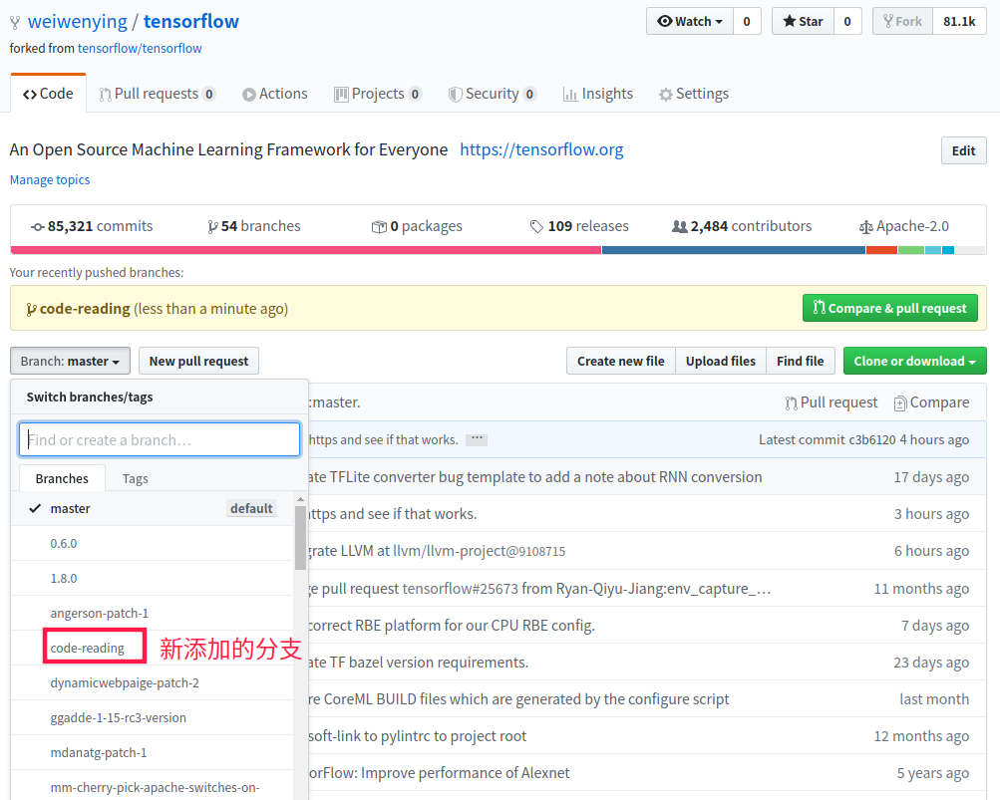

# 手把手教你TensorFlow源代码阅读

---

`时间：2020-05-08` `作者：魏文应`

---


# 代码准备

## 创建分支

检出TensorFlow相应版本：

```bash
# git checkout -b 新起一个分支名称 检出的TensorFlow版本
git checkout -b code-reading v2.2.0
```

然后执行上面的编译、安装、测试等操作:

```bash
# 检查bazel版本
bazel version
# 配置
./configure
# 编译
bazel build //tensorflow/tools/pip_package:build_pip_package
```

## Fork项目

在Github上，Fork拷贝TensorFlow项目，并为项目添加上面创建的 `code-reading` 这个分支。

>   Tips:
>
>   github的Fork功能，是拷贝复制项目的意思，将项目复制到你的账号下，比如我fork后，我得到如下项目：
>
>   ```bash
>   https://github.com/weiwenying/tensorflow.git
>   ```
>
>   然后，将分支 `code-reading` 推送到上面项目中：
>
>   ```bash
>   # git remote add 名称 你的仓库地址
>   git remote add wwy https://github.com/weiwenying/tensorflow.git
>   # git push 仓库地址名称 
>   git push wwy code-reading
>   ```
>
>   
>
>   还可以像我一样，添加笔记，并尝试提交：
>
>   ```bash
>   
>   ```

